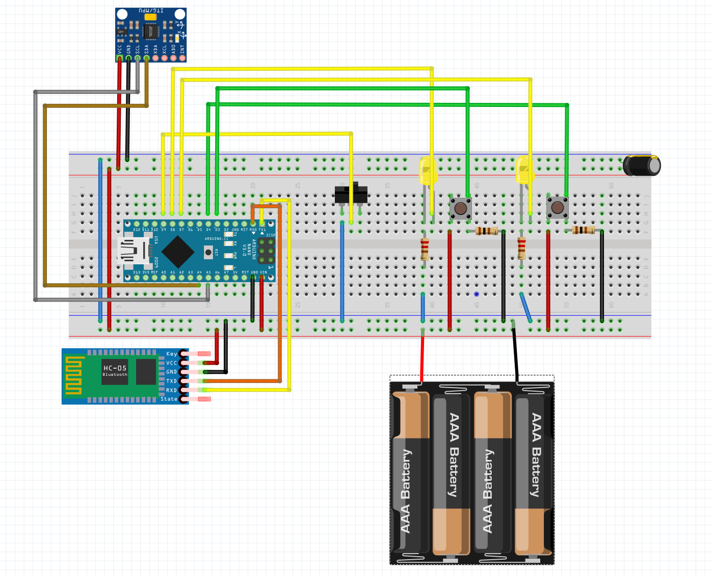
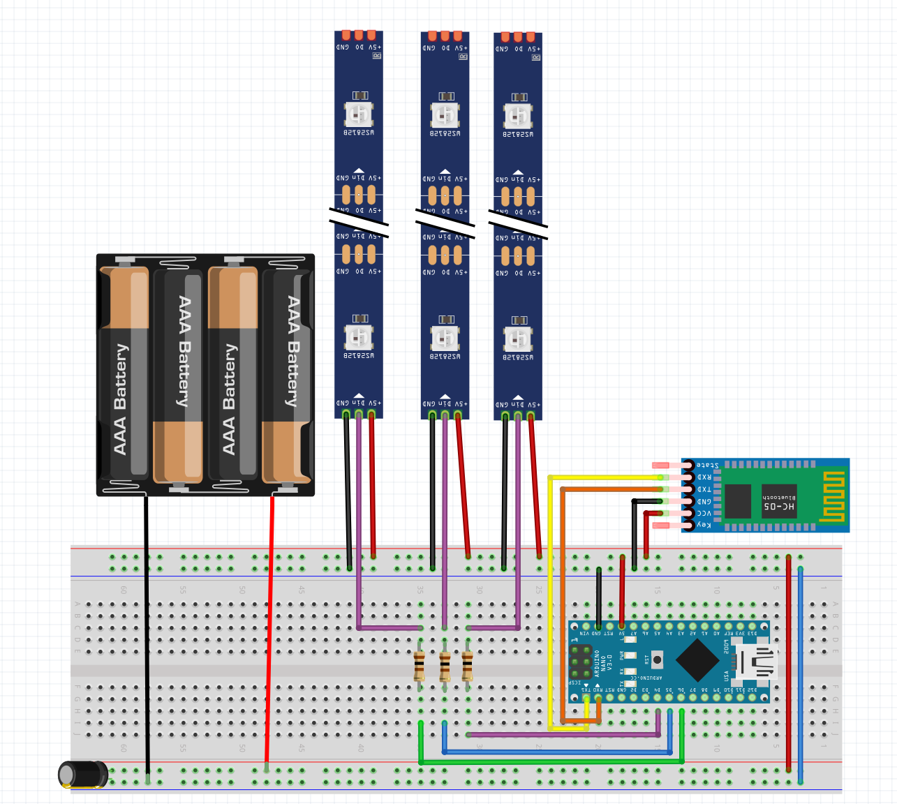
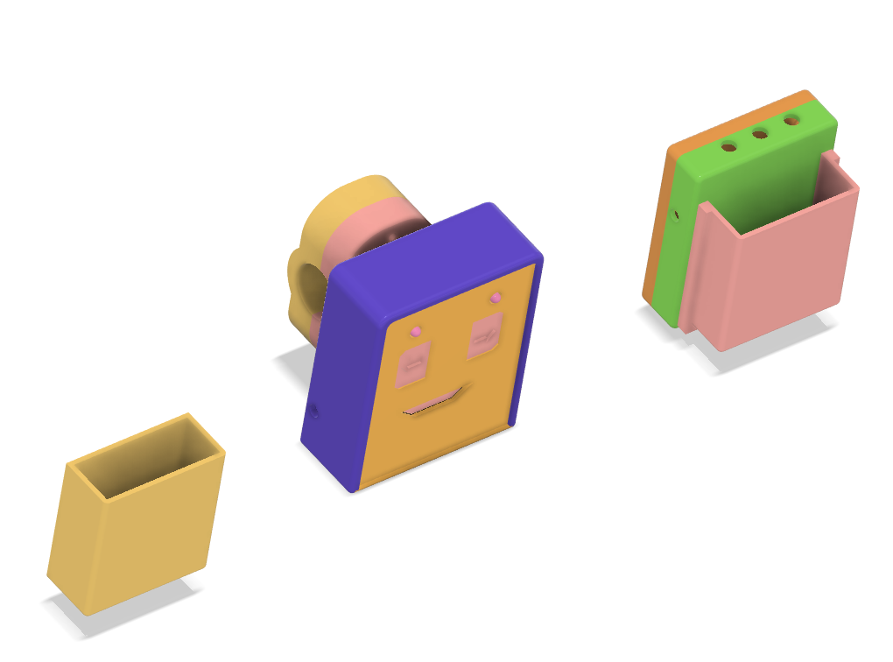
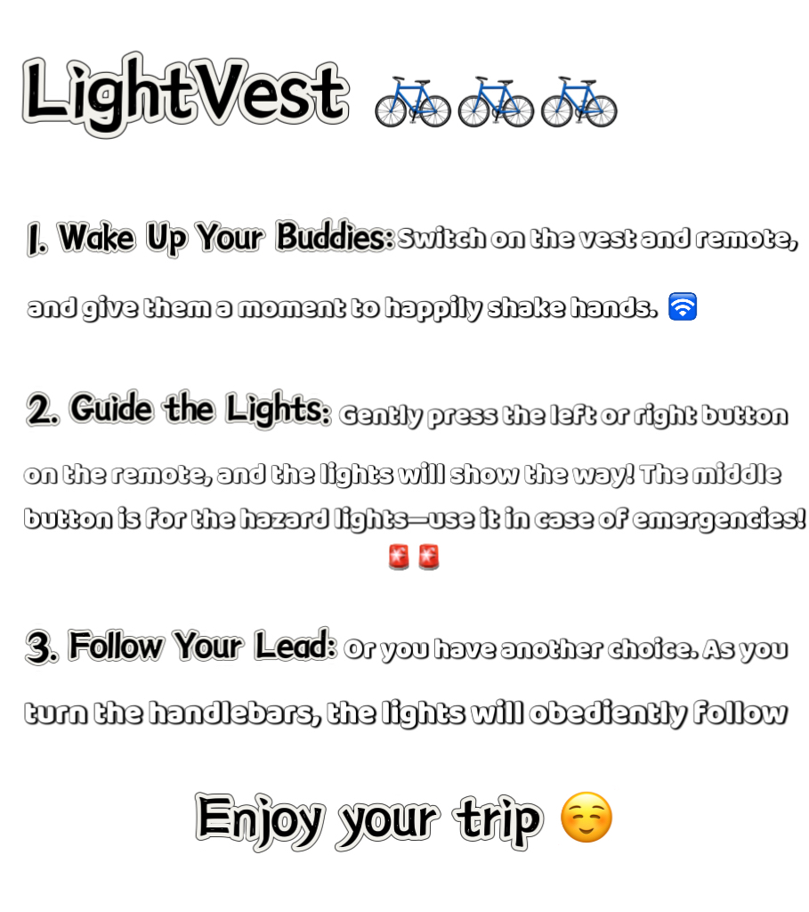

# LightVest🚦 Smart Turn Signal Vest
Welcome to the **LightVest** project! This wearable vest is designed to enhance cyclists' and motorcyclists' safety by providing clear, visible turn signals and hazard lights.
👇 ***Click the image below to watch the introduction video!*** 🎥

<p align="center">
  <a href="https://vm.tiktok.com/ZGe3J54N1/">
    
  </a>
</p>

## ✨ Features

- **Bluetooth Connectivity**: Automatically connects the vest and remote controller.
- **Button Control**: Control the lights using a handlebar-mounted remote with left, right, and hazard buttons.
- **Automatic Detection**: The vest automatically detects handlebar turns and activates the corresponding signal.
- **Emergency Lights**: Activate hazard lights with a single button press for added safety.
- **Easy to Remove and Clean**: The LED strips are designed to be easily detachable for convenient cleaning.
- **Easy Battery Replacement**: The battery compartment is designed for quick and simple replacement.

## 🛠️ Installation

### Hardware Setup

1. #### Components

| Component                        | Quantity | Description                                         |
|:----------------------------------:|:----------:|:-----------------------------------------------------:|
| **Arduino Nano**                     | 2        | Microcontroller for control and communication       |
| **Bluetooth Modules (HC-05)**        | 2        | For wireless communication between the Arduinos     |
| **Accelerometer (MPU6050)**          | 1        | Detect handlebar angle                              |
| **LED Strips**                       | 1        | For displaying turn signals on the vest             |
| **Push buttons**                     | 2        | Control left, right light                           |
| **Torch switches**                   | 1        | Control hazard lights                               |
| **Battery holder**                   | 2        | Hold and connect AA batteries                       |
| **AA batteries**                     | 6        | Power supply for the vest and remote                |
| **Jumper wires**                     | Several  | For connecting components                           |
| **Resistors**                        | Various  | To limit current and protect components             |
| **Capacitors**                       | Various  | For filtering and stabilizing voltage               |

2. #### Assembly

 **Bluetooth Pairing**:
   - Use a serial debugging tool to pair the two Bluetooth modules. The relevant software can be found in the `Test` folder.
   
 **Wiring the Components**:
   - Connect all components according to the wiring diagrams provided. The diagrams for the two sections are shown below:
     - **Remote Controller Wiring Diagram**: 
     - **Vest Wiring Diagram**: 
     
 **PCB Design**:
- The PCB design files are located in the `PCB` folder. If you wish to have your own vest, feel free to download them.

3. #### Enclosure
   - The 3D printing files for the enclosure are located in the `3D_Print` folder. Below is a preview of the enclosure design:
     - **Enclosure Design Preview**: 

## 💻 Software Setup

1. ### Clone the Repository

```bash
git clone https://github.com/pumpkins628/Light-for-You.git
cd Light-for-You
```

2. ### Upload Code

 - Open the Arduino IDE.
- Find the `Code/LED_suit_vest_bluetooth` folder and open the `LED_suit_vest_bluetooth.ino` file.
  Upload this code to the Arduino Nano, which you want to use to control the vest.
- Find the `Code/control` folder and open the `control.ino` file.
  Upload this code to the Arduino Nano, which you want to use to connect the light on the vest.

🚨 **Library Setup**
<br>
- Don't forget to import the required libraries into the Arduino IDE:
The necessary libraries can be found in the `Test` folder.
- To import a library, go to Sketch > Include Library > Add .ZIP Library... in the Arduino IDE, then select the relevant library files from the `Test` folder.

## 🚴‍♂️ Usage

### Power On
- Turn on the vest and remote by clicking their own switches.

### Control Signals
- **Left Turn**: Press the left button on the remote or turn the handlebars left.
- **Right Turn**: Press the right button on the remote or turn the handlebars right.
- **Hazard Lights**: Press the middle button on the remote to activate the hazard lights.

### Ride Safely
- Your vest will automatically display the correct signals based on your inputs!
  <br>
<p align="center">
  
</p>

## 🤝 Contributing
I welcome contributions! If you'd like to improve this project, feel free to fork the repository, create a new branch, and submit a pull request!
